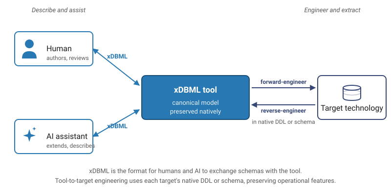

# xDBML

**[xDBML](https://xdbml.org/)** (eXtended Database Markup Language) is a **unified, open markup language** for **describing the shape** of structured and semi-structured data, plus the **declarative metadata** attached to that shape **across heterogeneous storage technologies**.

A single xDBML document expresses entities, tables, attributes, columns, fields, data types, nested structures, relationships, polymorphism, named reusable types, classification tags, business-glossary references, validation constraints, synonyms, and the polyglot target-native vocabulary that real enterprise data architectures use. It round-trips cleanly to engine-native DDL (Oracle, PostgreSQL, SQL Server, Databricks, Snowflake, MongoDB, Cassandra, Neo4j, etc.), to serialization schemas (Avro, Parquet), and to API contracts (JSON Schema, OpenAPI, GraphQL).

xDBML is a strict superset of [DBML 3.13.6](https://dbml.dbdiagram.io), the Database Markup Language maintained by Holistics under Apache 2.0, and **extends DBML** with the constructs it cannot currently express: explicit namespace levels, nested hierarchical types, structural polymorphism, first-class JSON columns with known shape, precise relationship cardinality, property-bearing graph edges, views, AI-readiness metadata, and a structured custom-properties mechanism.

## Designed for AI interactions

xDBML is designed from the ground up for **AI-assisted data modeling** and **AI-mediated schema interchange**. The language matches the way modern LLMs already describe schemas: nested structures are first-class, polymorphism uses the same `oneOf`/`anyOf`/`allOf` vocabulary as JSON Schema, paths into nested fields use unambiguous dotted notation, and every construct accepts `synonyms:`, `business_term:`, `tags:`, and `granularity:` settings that let natural-language queries resolve to canonical schema elements without guesswork. An LLM asked to "find the monthly recurring revenue field" should not have to infer from column naming conventions; xDBML lets the schema declare the semantics and synonyms explicitly.

The same metadata that helps LLMs also helps humans, governance platforms, data catalogs, and semantic-layer tools -- all of them benefit from explicit declarative meaning attached to the schema. Custom properties (via the `x_` prefix convention) let organizations attach domain-specific metadata without grammar changes, and the structured registry path means common patterns can be promoted to first-class status in future minor versions.

## Positioning

xDBML occupies the **schema layer of the modern data stack**. It carries **declarative meaning**: what data is called, what it represents, how it's classified. But deliberately leaves *computational* meaning (measures, metrics, aggregations) to semantic-layer formats like the Open Semantic Interchange [OSI](https://opensemanticinterchange.org) and dbt MetricFlow, *contractual* obligations (quality rules, SLAs, ownership, pricing) to data-contract formats like [ODCS](https://bitol.io), and *inferential* reasoning to knowledge-graph standards like [OWL](https://www.w3.org/OWL/) and RDF-star. xDBML is the shape-and-declarative-metadata-layer companion to all of these standards, generating the schemas they reference and consuming nothing they own.

The same xDBML document feeds an ODCS contract's schema section, an OSI semantic model's underlying tables, a SHACL validator's target shapes, and the SQL DDL that creates them.

xDBML is currently a draft v0.1 specification, stewarded by [Hackolade](https://hackolade.com) pending evolution to neutral governance, with the grammar finalized and an open ecosystem of parsers, generators, and importers being built under Apache License 2.0.

## Design philosophy

xDBML is the evolution of DBML from a lightweight schema-diagram language into a true metadata and semantic modeling language. Where DBML excels at simplicity and developer accessibility -- strengths that drove its adoption -- xDBML targets the additional needs of metadata-as-code, semantic grounding for AI, governance integration, and model-driven engineering, with richer support for validation rules, semantics, cardinality, annotations, and AI-friendly metadata.

The hardest design constraint on xDBML is not what to add, but what to leave out. Other standards started with similar ambitions and lost mainstream developer appeal through over-engineering -- piling up features until the cost of authoring exceeded the benefit.  The risk is to become another ambitious modeling standard that architects admire and developers avoid. 

xDBML aims to preserve DBML's readability and Git-friendly simplicity while adding the constructs the polyglot, AI-aware era requires. Every proposed extension is weighed against that constraint; constructs that would push xDBML toward XML-Schema complexity are deferred, simplified, or declined.

If xDBML succeeds at this balance, it can become a foundation for next-generation data modeling and AI-aware metadata systems -- one that real teams actually choose to write by hand, not just generate from heavier sources.

## Same frustrations as DBML -- plus the ones DBML cannot solve

xDBML is born to solve the same frustrations DBML was designed for:
- Difficulty building a mental "big picture" of an entire project's database structure
- Trouble understanding tables and what their fields mean
- ER diagrams and SQL DDL that are poorly written, hard to read, and usually outdated

Plus the additional pains DBML cannot solve: AI-readiness metadata for LLMs and governance platforms (synonyms, business terms, classifications, granularity), LLM-portable schemas that lower to any target without premature commitment, nested structures and polymorphism as first-class constructs (objects, arrays of records, oneOf alternatives with discriminators), schema drift across polyglot stacks (Oracle + MongoDB + Avro + BigQuery + Neo4j + ...), and property-bearing graph edges. See the [FAQ on xdbml.org](https://xdbml.org/faq) for the full positioning.

## Scope: what xDBML covers (and what it deliberately doesn't)

xDBML describes the **structural and semantic layer** of data: entities, fields, types, relationships, classifications, validation rules, and AI-readiness metadata. It is the format for **humans and AI to exchange schemas with an xDBML tool**.

xDBML is **not** the round-trip format between an xDBML tool or xDBML-compatible data modeling tool and a target technology. That tool-to-target round-trip happens in **native DDL or schema** -- the tool understands the target's complete capability surface (partitioning, sharding, tablespaces, replication, PL/SQL, triggers, identity columns, advanced constraints, refresh schedules) and preserves it in the tool's own canonical model. xDBML carries the parts of that model with meaning across boundaries.

Operational features, procedural code (PL/SQL, T-SQL, triggers, server-side functions), wire-protocol concerns (Avro evolution rules, Protobuf reserved fields, GraphQL federation directives), and query languages of any kind stay where they live. Adjacent standards layer above and below: ODCS for contracts, OSI and dbt MetricFlow for measures, OWL for inference, OpenLineage for lineage.

## Where to go next

- [`spec/v0.1.md`](./spec/v0.1.md) -- the full v0.1 language specification
- [`xDBML_in_5_minutes.md`](./xDBML_in_5_minutes.md) -- a fast-read introduction with worked examples
- [`faq.md`](./faq.md) -- frequently asked questions about scope, language design, and adoption
- [`grammar/`](./grammar) -- the ANTLR4 grammar and reference test corpus
- [`examples/`](./examples) -- reference xDBML documents covering a blog, e-commerce, IoT telemetry, social graphs, healthcare, and financial services
- **`integrations/`** (planned) -- generators and importers (SQL DDL, JSON Schema, Avro, OpenAPI, MongoDB validators, Neo4j/Cypher, ODCS)
- [xdbml.org](https://xdbml.org) -- canonical home, with the playground and community spaces planned
